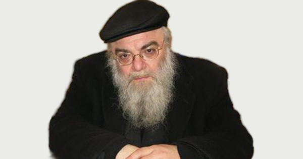

## То, что вы всегда хотели узнать о иудаизме. ##

27-го февраля, с Б-жьей помощью, у нас в гостях ожидается
[Ишайя Гиссер](https://ru.wikipedia.org/wiki/%D0%93%D0%B8%D1%81%D1%81%D0%B5%D1%80,_%D0%A8%D0%B0%D1%8F) -
“просветитель, раввин, духовный наставник сотен русскоязычных евреев, переводчик”.

Встреча с ним запланирована на 7 часов вечера по адресу:
39 Keefe Avenue, Newton, MA 02464 (дом Лёни и Нины Дубинских).
Рядом с полем на углу Chestnut Street и Pennsylvania Avenue есть площадка для машин.

Приглашаются интересующиеся обоего пола. Говорить будем на русском языке.
Формат - семинар: обсуждение различных тем, вопросы (и ответы).
Вход свободный и бесплатный. 

Если Вы хотите поддержать наши семинары по иудаизму деньгами, сдавайте их сюда:
Mazal Institute
64 Wallingford Road, Brighton, MA 02135
Paypal: mazalinst@gmail.com
