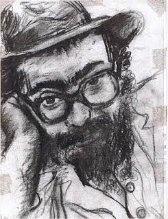

Дорогие друзья!

Приближается праздник [19 Кислева](http://www.chabad.org/library/article.asp?AID=63817) -
[Новый Год Хасидизма](http://www.chabad.org/library/article.asp?AID=335659).

На этот праздник в Бостон из Иерусалима приезжает раввин *Михоэль Кориц*.
Общение с раввином Корицем оказало значительное влияние на организаторов этого визита.
Мы уверены, что послушать его будет интересно всем. Приглашаем всех вас на встречу с ним,
которая состоится в 7 часов вечера в воскресенье 10 декабря в зале школы
[Шало Хауз](http://www.shaloh.org/) по адресу:
[29 Chestnut Hill Avenue в Брайтоне](http://maps.google.com/maps?f=q&hl=en&q=29+Chestnut+Hill+Avenue+Brighton+MA&ie=UTF8&z=16&om=1&iwloc=addr).
Тема встречи: "Что мы празднуем 19го Кислева? Что такое Хасидизм и зачем он нужен?".
Материалы, которые будут розданы перед лекцией, можно посмотреть
[тут](https://docs.google.com/document/d/1VfumAcWjdpuKBvGJSyipmEffiPosfJobpahimqrU8NE/edit?usp=sharing).

Михаэль Кориц родился в 1958 году в Ленинграде. В 1979 году, будучи студентом математического
факультета университета, принял решение об отъезде в Израиль. Тогда же он пришел к изучению Торы и
соблюдению заповедей. В Иерусалиме, сделав непростой выбор между продолжением математического
образования и учебой в ешиве, за несколько лет напряженных занятий он из подающего надежды
студента-математика превратился в одного из ведущих студентов и молодых преподавателей ешивы «Шамир».

В начале перестройки, когда огромная масса эмигрантов устремилась из СССР за границу, был приглашен
на должность помощника Ладиспольского раввина, а затем - в Ленинград, для работы в еврейской общине
в качестве посланника Любавического Ребе. С 1989 по 1994 год Михаэль Кориц с семьей прожил в
Ленинграде-Петербурге.

Вернувшись в Израиль, работал в иерусалимской ешиве «Мерказ Гутник» в должности «машпиа» -
преподавателя и воспитателя. В 1999 году ешива «Мерказ Гутник» была распущена, и раввину Корицу
пришлось вспомнить о своем математическом образовании. Оно очень пригодилось начинающему
программисту, отцу девятерых детей. С тех пор равинство превратилось во вторую специальность:
в свободное от работы время раввин Кориц отвечает на раввинские вопросы в Интернете
([http://www.rabbi.ru](http://www.rabbi.ru)), редактирует и переводит еврейские тексты, выступает
на телевидении, по вечерам - преподает Тору, а во время отпусков – ездит с лекциями по приглашению
общин разных стран.

С вопросами и предложениями по поводу этого мероприятия обращайтесь по адресу
19-kislev-5767@podval.org или по телефону (617) 571-4962 (Лёня).
