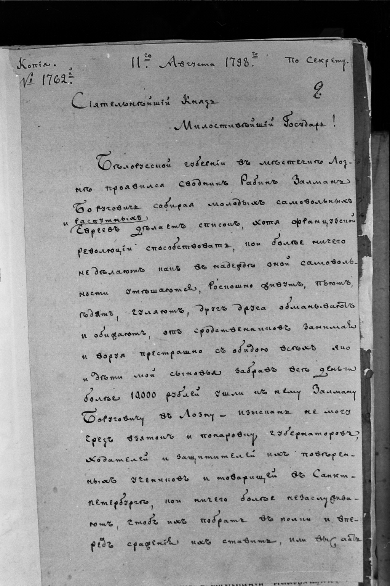
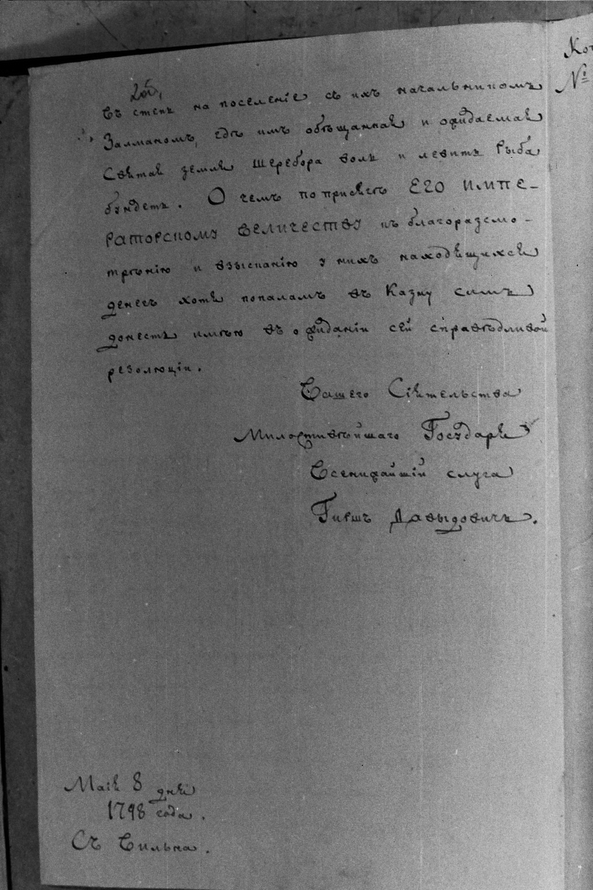
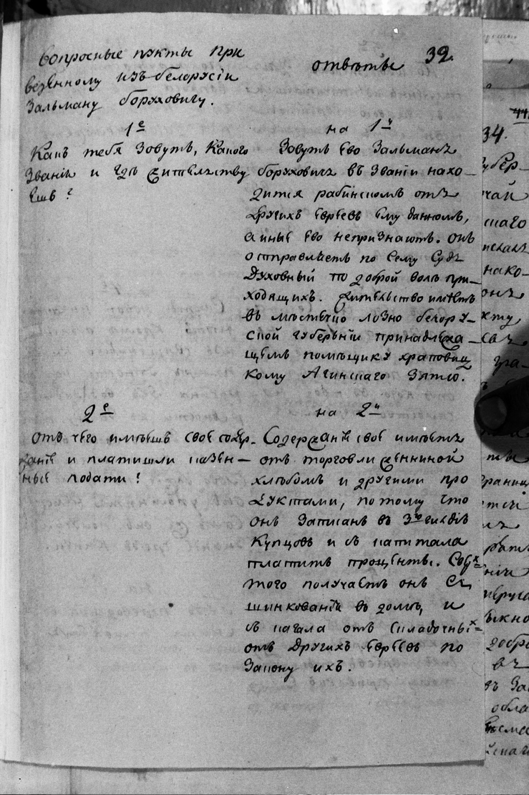
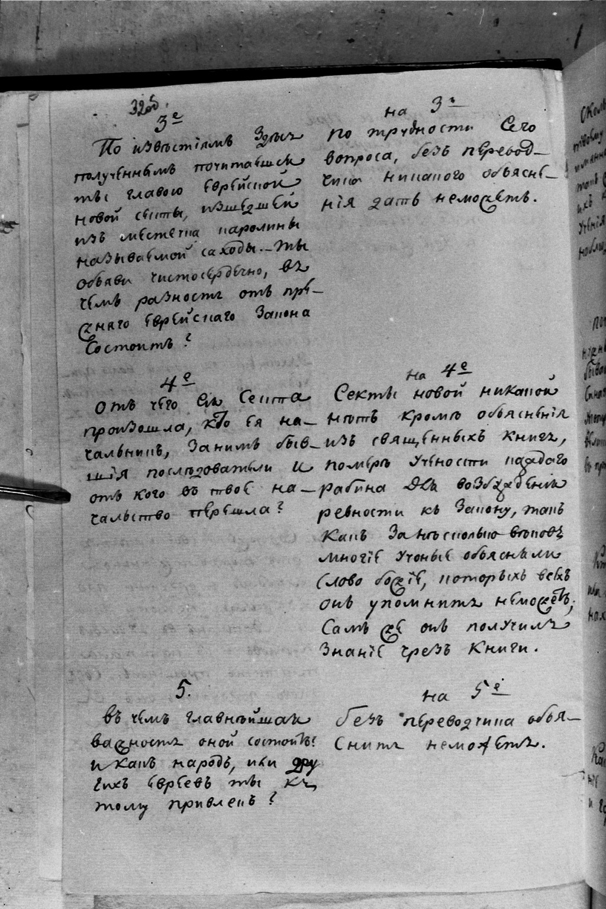
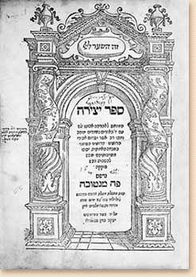
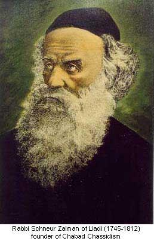

## Что мы празднуем 19го Кислева? ##
## Что такое Хасидизм и зачем он нужен? ##

19-20 Кислева 5767 года, 10 декабря 2006, Бостон

Раввин Михоэль Кориц

Фотографии документов из дела Альтер Ребе находятся по адресу:
[http://www.alter-rebbe.org](http://www.alter-rebbe.org/).

С замечаниями по поводу этого мероприятия обращайтесь по адресу
19-kislev-5767@podval.org или по телефону (617) 571-4962 (Лёня).

### Мишна (трактат "Хагига") о разрешенных и запрещенных лекциях ###

Mishna, Tractate Hagiga, Chapter II

MISHNA: One should not discuss illegal unions unless there were three besides him, nor the creation
unless there were two besides him, nor the divine chariot with one individual, unless he was a wise
man and had much knowledge of his own. Every one who tries to know the following four things, it
were better for him if he had never come into the world, viz.: What is above and what is beneath,
what was before creation, and what will be after all will be destroyed. And every one who does not
revere the glory of his Creator, it were better for him he had not come into the world.

From [http://www.jewishvirtuallibrary.org/jsource/Talmud/hagiga2.html](http://www.jewishvirtuallibrary.org/jsource/Talmud/hagiga2.html)

### 28 высказываний Альтер Ребе ###

1. This is what man is all about; this is the purpose of his creation and of the creation of all the
   worlds, sublime and lowly -- to make for G-d a dwelling in the physical world.
2. A little bit of light dispels a lot of darkness.
3. By virtue of its inborn nature, the mind rules the heart.
4. Prayer without direction of the heart is like a body without a soul... Love of G-d and fear of G-d
are the two wings by which a deed rises heavenward.
5. Every individual Jew, righteous or wicked, has two souls... One soul derives from *kelipah* (the
"husks" of creation) and *sitra achra* (the "other side"), and clothes itself in the blood to animate
the body... From it derive the evil traits... and also the Jew's instinctive good traits... The
second soul in the Jew is literally a "part of G-d above."
6. "The soul of man is a lamp of G-d" (Proverbs 20:27). Just like the flame of the lamp strains
upwards, seeking to tear free of the wick and rise heavenward - though this would spell its own
demise - so, too, does the G-dly soul in man constantly strive to tear free of the body and the
material existence and be nullified within its source in G-d.
7. The body is likened to a small city: like two kings who wage war over a city, each desiring to
capture it and rule over it, that is, to govern its inhabitants according to his will so that they
obey him in all that he decrees for them, so do the two souls - the G-dly [soul] and the animal
[soul] - wage war against each other over the body and all its organs and limbs. The desire and will
of the G-dly soul is that it alone should rule over the person and direct him, and that all his limbs
should obey it and surrender themselves completely to it and become a vehicle for it, and serve as a
vehicle for its ten faculties [of intellect and emotion] and three "garments" [thought, speech and
action]... and the entire body should be permeated with them alone, to the exclusion of any alien
influence, G-d forbid... While the animal soul desires the very opposite...
8. There are two types of pleasure before G-d. The first is from the complete nullification of evil
and its transformation from bitterness to sweetness and from darkness to light by the perfectly
righteous. The second [pleasure] is when evil is repelled while it is still at its strongest and
mightiest... through the efforts of the "intermediate man" (*beinoni*)... As in the analogy
of physical food, in which there are two types of delicacies that give pleasure: the first being
the pleasure derived from sweet and pleasant foods; and the second, from sharp and sour foods,
which are spiced and prepared in such a way that they become delicacies that revive the soul...
9. When one's body is viewed with scorn and contempt, and one's joy is in the soul alone, this
constitutes a direct and simple way to fulfill the commandment "Love your fellow as yourself"
toward every Jew, great or small... For the source of their souls is in the One G-d, and they
are divided only by virtue of their bodies. Therefore, those who give priority to their body over
their soul, find it impossible to share true love and brotherhood except that which is conditional
on some benefit. This is what Hillel the Elder meant when he said about this commandment [the love
of Israel]: "This is the whole Torah; and the rest is commentary." For the foundation and source of
all Torah is to elevate and give ascendancy to the soul over the body ...
10. Also those who are far from G-d's Torah and His service... one must draw them close with strong
cords of love -- perhaps one might succeed in bringing them closer to Torah and the service of G-d.
And even if one fails, one has still merited the rewards of the fulfillment of the Mitzvah, "Love
your fellow."
11. It is written: "Forever, O G-d, Your word stands firm in the heavens" (Psalms 119:89). Rabbi
Israel Baal Shem Tov, of blessed memory, explained the verse thus: Your word which you uttered,
"Let there be a firmament..." (Genesis 1:6), these very words and letters stand firmly forever
within the firmament of heaven and are forever clothed within the heavens to give them life and
existence... And so it is with all created things, down to the most corporeal and inanimate of
substances. If the letters of the "ten utterances" by which the world was created during the six
days of creation were to depart from it for but an instant, G-d forbid, it would revert to absolute
nothingness.
12. If the human eye were allowed to see the spiritual vitality flowing from the utterance of G-d's
mouth into every creation, we would not see the materiality, grossness and tangibility of the creation,
for it would be utterly nullified in relation to this divine life-force.
13. The era of Moshiach is the fulfillment and culmination of the creation of the world, for which
purpose it was originally created. Something of this revelation has been experienced once before on
earth, at the giving of the Torah at Mount Sinai [when] "To you it has been shown, to know that the
L-rd is G-d; there is none else beside Him" (Deuteronomy 4:35). G-dliness was then perceived with
physical vision.... Subsequently, however, sin coarsened both them and the world - until the era of
Moshiach, when the physicality of the body and the world will be refined, and we will be able to
apprehend the revealed Divine light which will shine forth to Israel by means of the Torah.... "The
glory of G-d will be revealed; and all flesh will see that the mouth of G-d has spoken" (Isaiah
40:5)... This all depends on our deeds and labor throughout the duration of the *galut*... When a person
does a mitzvah, he draws down a flow of Divine light into the world, to be suffused and integrated into
the material reality...
14. Our sages have taught, "Whoever gets angry, it is as if he worshipped idols" (Zohar I, 27b). The
reason for this is... because at the time of his anger, his faith has left him. For were he to believe
that what happened to him was G d’s doing, he would not be angry at all. For although it is a person
possessed of free choice that is cursing him, or striking him, or causing damage to his property -- and
is accountable according to the laws of man and the laws of heaven for his evil choice -- nevertheless,
as regards the person harmed, this [incident] was already decreed in heaven and “G-d has many agents”
[to carry out the decree]...
15. Rabbi Mordechai of Haradak, a disciple of Rabbi Schneur Zalman, told: The first thing we heard from
the Rebbe was: "What is forbidden, one must not; and what is permitted, one need not." Three or four
years we toiled with this, until we this approach was ingrained in our lives. Only then would we be
received in a private audience with the Rebbe to ask about our individual paths in serving the Almighty.
16. _To a disciple who complained of his financial troubles:_ You speak of what you need, but you say
nothing of what you are needed for.
17. "One who is satisfied with his lot" (Ethics of the Fathers 4:1) describes a tremendous virtue in
material matters, and a tremendous failing in all that pertains to one's spiritual attainments.
18. During the time that Rabbi Schneur Zalman was imprisoned in Petersburg, one of the czar's ministers
asked him to explain the verse (Genesis 3:9) "And G-d called out to the man and said to him: Where are
you?" Did G-d not know where Adam was? Rabbi Schneur Zalman asked the minister: Do you believe that the
Torah is eternal, that its every word applies to every individual, under all conditions, at all times?
The minister replied that he did. Rabbi Schneur Zalman was very gratified to hear this, for this was a
basic principle of the "subversive" teachings of the Baal Shem Tov, the propagation of which was at the
heart of the accusations leveled against him. "Where are you?" said Rabbi Schneur Zalman to the minister,
"is G-d's perpetual call to every man. Where are you in the world? You have been allotted a certain number
of days, hours, and minutes in which to fulfill your mission in life. You have lived so many years and so
many days -- Where are you? What have you accomplished?"
19. Once, in the early years of his leadership, Rabbi Schneur Zalman of Liadi said to his disciples:
"One must live with the times." He later explained his meaning: One should live with and experience in
one's own life the Torah portion of the week and the specific section of the week's portion which is
connected to that day.
20. In essence, every mitzvah is as supra-rational as the law of the Red Heifer. It is only that the divine
will is revealed to us in varying degrees of rational "garments".
21. There is love like fire, and there is love like water.
22. Following his release from imprisonment on Kislev 19, 5559 (1798), an event which marked the
Chassidic movement's decisive victory over its opponents, Rabbi Schneur Zalman sent a letter to his
followers. The letter begins by quoting the verse in which Jacob says to G-d, "I am diminished by all the
kindnesses... You have shown Your servant" (Genesis 32:11). "The meaning of this," explains Rabbi Schneur
Zalman "is that every kindness bestowed by G-d upon a person should cause him to be exceedingly humble.
For a [Divine] kindness is [an expression of] ... 'His right hand does embrace me' (Song of Songs 2:6) --
G-d is literally bringing the person close to Himself, far more intensely than before. And the closer a
person is to G-d ... the greater the humility this should evoke in him... This because 'all before Him is
as naught' (Zohar), so that the more 'before Him' a person is, the more 'as naught' [does he perceive
himself to be].... This is the attribute of Jacob... The very opposite is the case in the contrasting
realm of ... kelipah (evil): the greater the kindness shown a person, the more he grows in arrogance and
self-satisfaction..." The letter concludes: "Therefore, I come with a great call to all our community
regarding the many kindnesses which G-d has exceedingly shown us: Assume the attribute of Jacob... Do not
feel yourselves superior to your brethren (i.e., the opponents of Chassidism); do not give free rein to
your mouths regarding them, or hiss at them, G-d forbid. [I] strictly warn: Make no mention [of our victory].
Only humble your spirits and hearts with the truth of Jacob..."
23. The life of a tzaddik is not a life of the flesh, but a spiritual life consisting wholly of faith, awe,
and love of G-d
24. "And now, Israel: What does the L-rd your G-d ask of you? Only to fear G-d" (Deuteronomy 10:12). Regarding
this verse, the Talmud asks: "Is fear of G-d a minor thing?" The answer given is, "Yes, for Moses it is a minor
thing." At first glance, this answer is incomprehensible, since the verse says "What does G-d ask of you" - i.e.,
every individual Jew! But the explanation is as follows: Each and every soul of the house of Israel contains
within it something of the quality of our teacher Moses, for he is one of the "seven shepherds" who feed vitality
and G-dliness to the community of the souls of Israel.... Moses is the sum of them all, called the "shepherd of
faith" (*raaya meheimna*) in the sense that he nourishes the community of Israel with the knowledge and recognition
of G-d... So although who is the man who dares presume in his heart to approach and attain even a thousandth part
of the level of the faithful shepherd, nevertheless, an infinitesimal fringe and minute particle of his great
goodness and light illuminates every Jew in each and every generation.
25. It is stated in the sacred Zohar that "When the *tzaddik* departs he is to be found in all worlds more than in
his lifetime." Now this needs to be understood. For, granted that he is to be found increasingly in the supernal
worlds, because he ascends to there; but how can he be found more in this world? ... This can be explained based
on [the maxim] that the life of a *tzaddik* is not a physical life but a spiritual life, consisting wholly of faith,
awe, and love of G-d... While the *tzaddik* was alive on earth, these three qualities were contained in their physical
vessel and garment (i.e. the body) on the plane of physical space... All his disciples receive but a reflection of
these attributes, a ray radiating beyond this vessel by means of his holy utterances and thoughts... But after his
passing... whoever is close to him can receive a [far loftier dimension] of these three qualities, since they are no
longer confined within a [material] vessel, nor bounded by physical space... Thus it is very easy for his disciples
to receive their part of their master's quintessential spirit, each according to the level of his loving attachment
(*hitkashrut*) and closeness to the *tzaddik* during his lifetime and after his death...
26. Rabbi Schneur Zalman's disciples would say: Our Rebbe revives the dead. What is a corpse? Something cold and
unfeeling. Life is movement, warmth, excitement. Is there anything as frozen in self-absorption, as cold and unfeeling
as the mind? And when the cold-blooded mind understands, comprehends, and is excited by a G-dly idea - is this not a
revival of the dead?
27. Before a king enters the city, the people of the city go out to greet him in the field. There, everyone who so
desires is permitted to meet him; he receives them all with a cheerful countenance and shows a smiling face to them
all. And when he goes to the city, they follow him there. Later, however, after he enters his royal palace, none can 
enter into his presence except by appointment, and only special people and select individuals. So, too, by analogy,
the month of Elul (which precedes G-d's "coronation" as King on Rosh Hashanah) is when we meet G-d in the field.
28. _From a note penned by Rabbi Schneur Zalman shortly before his passing:_ The truly humble soul recognizes that its
mission in life lies in the pragmatic aspect of Torah, both in studying it for himself and explaining it to others; and
in doing acts of material kindness by lending an empathizing mind and counsel from afar regarding household concerns,
though the majority, if not all, of these concerns are things of falsehood. For the loftiest beginnings are rooted in
the end.

From [http://www.chabad.org/library/article.asp?AID=3074](http://www.chabad.org/library/article.asp?AID=3074)

### Донос на Альтер Ребе ### 


### Протокол первого допроса Альтер Ребе ###


### Иллюстрации ###

