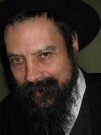

Дорогие друзья!

Приближается [начало](http://www.chabad.org/calendar/view/day.asp?AID=297584) месяца Менахем Ав и
[9 дней](http://www.chabad.org/holidays/3weeks/calendar/article.asp?AID=144574) завершающих
[3 недели](http://www.chabad.org/holidays/3weeks/article.asp?AID=144558).

В связи с этим в Бостон из Торонто приезжает раввин *Гирш Рабиский*. Общение с раввином Гиршем оказало
значительное влияние на организаторов этого визита. Мы уверены, что послушать его будет интересно всем.
Приглашаем всех вас на встречу с ним, которая состоится в 8 часов вечера в понедельник 16 июля в здании
[Шало Хауз](http://www.shaloh.org/) по адресу:
[29 Chestnut Hill Avenue в Брайтоне](http://maps.google.com/maps?f=q&hl=en&q=29+Chestnut+Hill+Avenue+Brighton+MA&ie=UTF8&z=16&om=1&iwloc=addr).

Тема встречи: "Что такое *исхапха* (преображение, например: тьмы - в свет, зла - в добро) и как это делается".

Рабби Гирш Рабиский родился в России, в семье, которая продолжала вести еврейский образ жизни несмотря
ни на что. Подпольно обучался Иудаизму. В возрасте 14 лет выехал с семьёй в Израиль.

Закончив обучение в ешивах Израиля, Франции и Нью Йорка, рабби Рабиский на протяжении 10 лет (1980-1990)
был посланником Любавического Ребе в Италии. Десятки тысяч евреев познакомились с рабби Гиршем - и с
Иудаизмом - в Ладисполи.

С 1990 года рабби Гирш - посланник Любавического Ребе в Торонто, где он возглавляет организацию
"[Маон Ноам](http://www.maonnoam.org/)", преподаёт в хедере, даёт уроки Иудаизма, руководит синагогой,
отвечает на вопросы...

Будучи большим знатоком Хасидизма, рабби Гирш известен умением донести глубокие идеи Внутренней Торы
до собеседников, не закончивших Любавических ешив :)

С вопросами и предложениями по поводу этого мероприятия обращайтесь по адресу av-5767@podval.org или
по телефону (617) 571-4962 (Лёня).

